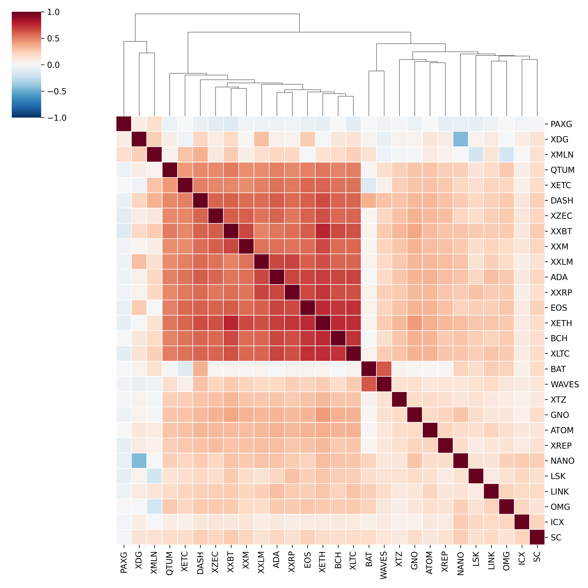
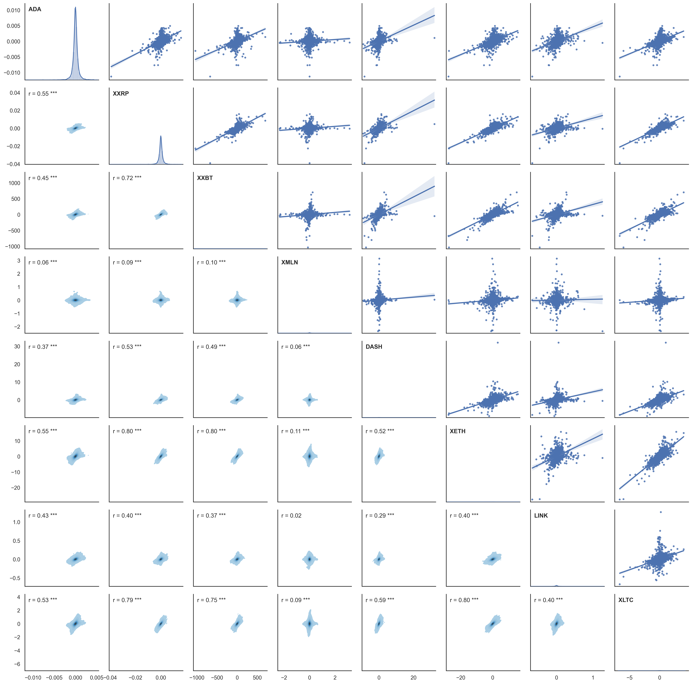
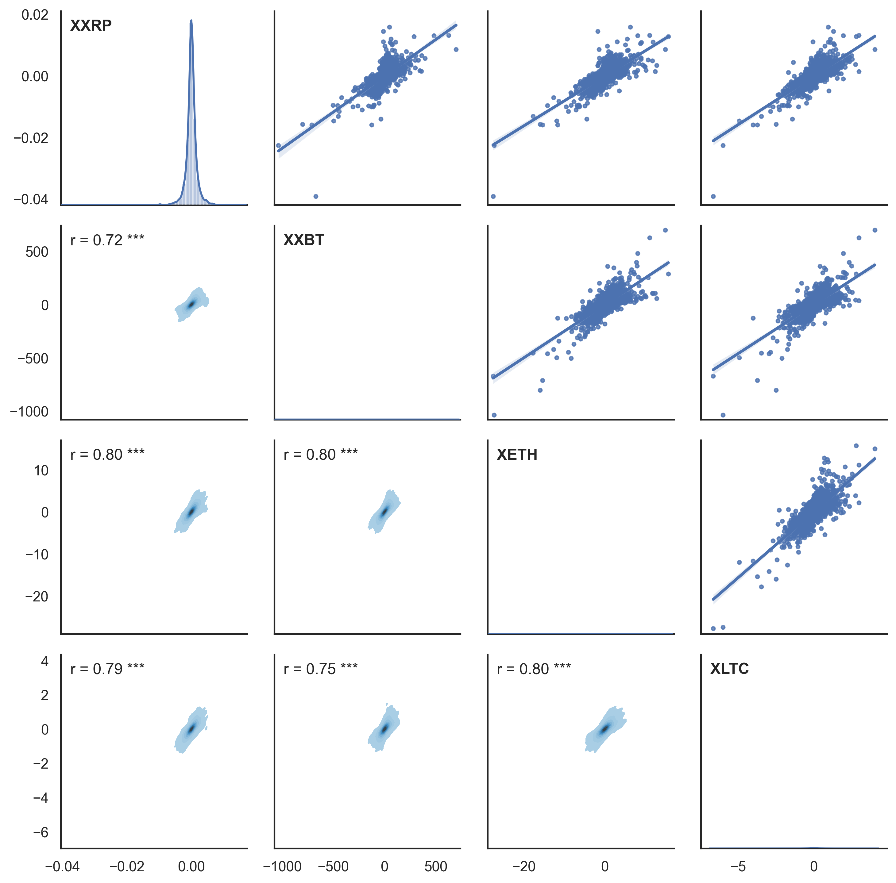

# Cryptocurrency price correlations

## Aim of the project
This project explains how to compute price correlations between different cryptocurrencies in Python based on price history 
files of cryptocurrencies of interest.

## Dependencies
### First set-up
1. Download `virtualenv` if you do not alread have it
```bash
pip install virtualenv
```
2. Create virtual environment in your folder of interest
```bash
virtualenv crypto-correlations
```
3. Activate the virtual environment
```bash
source crypto-correlations/bin/activate
```
4. Install the libraries of interest in the virtual environment based on the `requirements.txt` file
```bash
pip install -r requirements.txt
```

### Re-activate virtual environment every time you need to extract data
```bash
source crypto-correlations/bin/activate
```


## Instructions
### Input files
Each cryptocurrency history data file should be stored in the folder `crypto_history`. The price correlation script 
`price_correlations.py` will extract the history data based on the following format:
```
price   volume  time    buy/sell        market/limit    miscellaneous   Since
1.114431        18.07332223     1606777316.4328 b       l               1606777200.0
1.121256        17.96331051     1606777381.7706 b       l               1606777200.0
1.125000        998.40255591    1606777840.5439 b       m               1606777200.0
...
```
The input file `crypto_history/LSKEUR_close_price.txt` was provided as an example. In case you want to use a different 
format, make sure to modify the function `extract_mean_price_ph` in the script `price_correlation.py`.

### Date and cryptocurrency list configuration
The start date and end date timestampps should be defined in `config.txt` (please refer to the file for more detail 
regarding the format). The graph first start and second start dates, which are simply two different time frames for 
the graphs should be defined in this same configuration file. A large list of cryptocurrency symbols should be defined 
in this same configuration file to compute large correlations. A short list of cryptocurrency symbols should be defined 
in this same configuration file.

### Compute the correlations
Once the input price history files and the configuration file are ready, the following command will compute the 
correlations:
```bash
python3 price_correlation.py
```

## Results
### Output example 1 - Clustermap


### Output example 2 - Large correlation matrix


### Output example 3 - Small correlation matrix


### Warning
There seems to be an issue with the significance symbol association on the plots.
